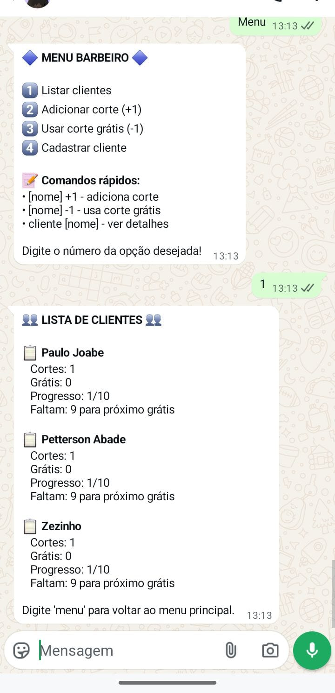
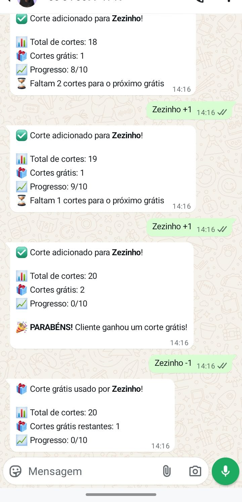

# 📌 Barbershop Loyalty

Project with **Laravel (API)** + **Node.js (WhatsApp Bot)** running on **Docker**.

The bot uses the [whatsapp-web.js](https://github.com/pedroslopez/whatsapp-web.js) library.

---

## 🚀 How to run

### 1. Clone the repository
```bash
git clone git@github.com:AbadePetterson/barbershop-loyalty.git
cd barbershop-loyalty-base

```
### 2. Start the containers
```bash
docker compose up -d --build

docker compose exec laravel.test php artisan migrate
```
### 3. Scan the WhatsApp QR Code
```bash
docker logs -f node_bot
```
Open WhatsApp → Linked Devices → Scan the QR Code.


### Menu & Clients List


### Add and usage cut free
